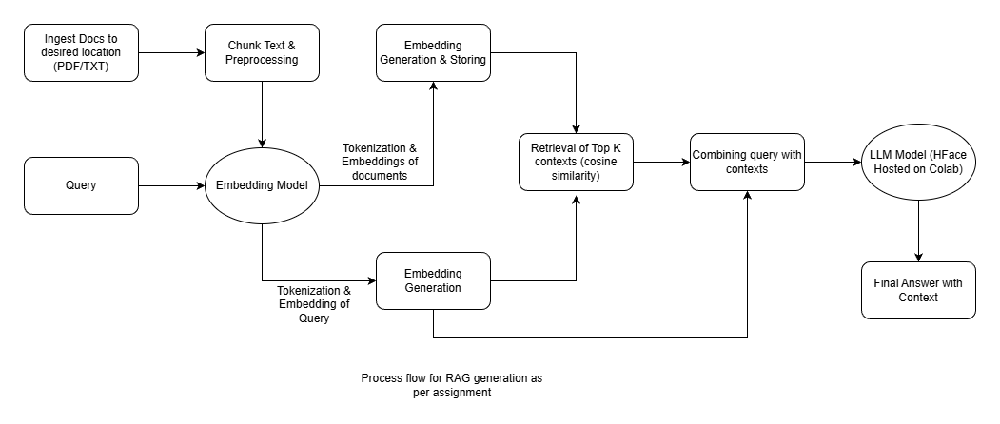

# RAG Document QA System — Design & Notes (Interview Assignment)

## a) Setup 

1. This repository was created on colab using models from Huggingface (needs GPU). A100 is used for best results in terms of latency. Just install the requirements using "pip install -r requirements.txt" or run the first cell in the rag_experiments.ipynb file. 
2. use rag_experiments to perform evaluation on a gold dataset (to pick best configuration of llm, embedding model, retrieval parameters) and inference for any custom question
3. Currently used documents are present in this [drive folder](https://drive.google.com/drive/folders/1PiRrFQYI5kswCLHZsFbnDfRHtmwIgJ-k?usp=sharing)

## b) Architecture overview

**High-level flow**
1. **Ingest docs** (PDF / TXT)
2. **Chunk text** into overlapping segments
3. **Embed chunks** using a sentence embedding model
4. **Store embeddings** in a vector index (FAISS)
5. For a user question:
   - embed query
   - retrieve top-*k* chunks
   - send (question + retrieved context) to an LLM
   - return an answer with citations
6. I have also created a utility to evaluate on a gold dataset to compare across multiple llm, embedding models, retrieval parameters to find the most optimal solution

## c) Productionalize on AWS

To achieve production the following needs to be done : 
1. Create an AWS ec-2 instance with appropriate resources including GPU (A100/T4)
2. Containerisation of the inference script within a docker container
3. Creating a UI layer (as simple as streamlit) to take in the files and show the generated result with option to view the retrieved context
4. Creating multiple services : ui_service, llm_service, retriever_service, file_handling service and orechestrating them through docker compose to connect each of them 
5. The above service based setup enables us to update and maintain individual components without hampering overall code setup 
6. Exposing the UI frontend through the public IP of the ec-2 instance

## d) Key Decisions

1. models : Used models from huggingface ("Qwen/Qwen2.5-1.5B-Instruct and TinyLlama/TinyLlama-1.1B-Chat-v1.0 for ease, low cost setup on colab. I had no api access to any LLM services
2. embedding model : sentence-transformers/all-MiniLM-L6-v2 & sentence-transformers/all-mpnet-base-v2. The former for small size and lower runtime and latter for better results
3. Vector DB : FAISS for its open source support and previous experience
4. Prompt, Context management & Guardrails : Threshold based guardrails to ensure no incorrect answers pass through. Also configured to "No answer" if no confident context achieved
5. Quality & Observability controls : Gold evaluation set + objective metrics:
  - **RetrievalHit@k**
  - **Precision@k**
  - **AnswerPhraseRecall**
  - latency + token usage
  
## e) Key technical decisions and why

### 1) Overlapping chunking
I chose chunk overlap because legal definitions and clauses often span multiple lines. Overlap reduces the chance that key terms land exactly at chunk boundaries.

### 2) Dense retrieval baseline first
I started with dense retrieval because it handles paraphrasing well, and it’s a standard RAG baseline that’s easy to defend in an interview.

### 3) Strict prompting + refusal rule
Small models hallucinate easily. A strict prompt plus a retrieval-confidence cutoff improves correctness and makes behavior predictable.

## f) Engineering standards followed (and some skipped)

Some standards followed : 
1. Modularisation
2. Separation of utilities from main code
3. Commenting important places
4. Readme file

Standards skipped :
1. Containerisation
2. No persistent Vector DB
3. No reranking yet
4. No UI layer

## how I used AI tools

I have used ChatGPT and Grok (limited) for establishing baseline boilerplate code, debugging, creating specific utilities, Generating test cases from the docs (verified with a SME)

## h) What I’d do differently with more time

1. Better retrieval method : Add reranker and follow a hybrid reranking system
2. Stronger evaluation : Add more semantic metrics rather than just keywords based metrics, add hallucination centric metrics, use LLM as a judge
3. Productionalise the solution with minimal UI and host on AWS